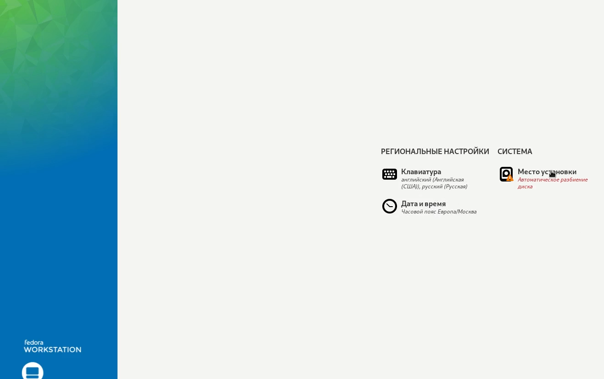

---
## Front matter
lang: ru-RU
title: "Отчёт по лабораторной работе №1"
author: "Мухин Тимофей Владимирович" 
institute: "Российский Университет Дружбы Народов" 
date:   "02.2023"

## Formatting
toc: false
slide_level: 2
theme: metropolis
header-includes: 
 - \metroset{progressbar=frametitle,sectionpage=progressbar,numbering=fraction}
 - '\makeatletter'
 - '\beamer@ignorenonframefalse'
 - '\makeatother'
aspectratio: 43
section-titles: true
---

# Цель работы 

## Цель работы

Целью данной работы является приобретение практических навыков установки операционной системы на виртуальную машину, настройки минимально необходимых для дальнейшей работы сервисов.

# Выполнение работы

## Выполнение работы

1. Устанавливаем VirtualBox.

{ #fig:001 width=80% }

## Выполнение работы

2. Cкачиваем установочный образ дистрибутива Fedora с getfedora.org.

{ #fig:001 width=70% }

## Выполнение работы

3. Cоздаем новую виртуальную машину в virtualbox. 

{ #fig:001 width=80% }

## Выполнение работы

4. Указываем имя виртуальной машины (логин в дисплейном классе), тип операционной системы — Linux, Fedora.

{ #fig:001 width=70% }

## Выполнение работы

5. Указываем  размер основной памяти виртуальной машины — от 2048 МБ. Задаем конфигурацию жёсткого диска — загрузочный, VDI (VirtualBox Disk Image), динамический виртуальный диск.

{ #fig:001 width=70% }

## Выполнение работы

6. Добавляем новый привод оптических дисков и выбираем образ Fedora.

{ #fig:001 width=70% }

## Выполнение работы

7.1.  Запускаем виртуальную машину и устанавливаем ОС

{ #fig:001 width=70% }

## Выполнение работы

7.2. Запускаем виртуальную машину и устанавливаем ОС

{ #fig:001 width=70% }

## Выполнение работы

7.3. Запускаем виртуальную машину и устанавливаем ОС

{ #fig:001 width=70% }

## Выполнение работы

8. Запускаем установленную ОС, извлекаем iso-образ, если  это не произошло автоматически

{ #fig:001 width=70% }

## Выполнение работы

9.1.  Выполняем основные настройки. Создаем пользователя, задаем пароль.

{ #fig:001 width=70% }

## Выполнение работы

9.2.  Выполняем основные настройки. Создаем пользователя, задаем пароль.

{ #fig:001 width=70% }

## Выполнение работы

10. В окне терминала проанализируем последовательность загрузки системы, выполнив команду dmesg. Просматриваем вывод команды. Получите следующую информацию:  Версия ядра Linux, частота процессора, модель процессор, объём доступной оперативной памяти 

{ #fig:001 width=50% }

# Вывод

## Вывод 
Я приобрел практические навыки установки операционной системы на виртуальную машину, настройки минимально необходимых для дальнейшей работы сервисов.

