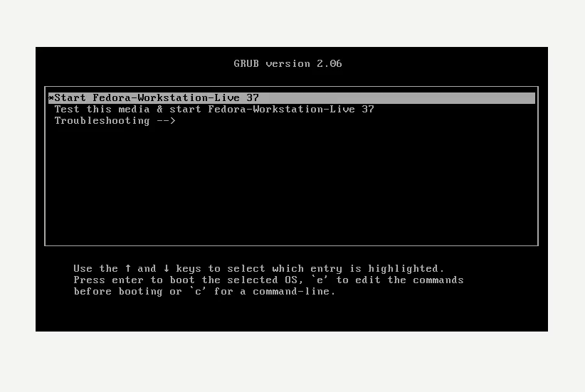

---
## Front matter
title: "Лабораторная работа №1"
author: "Мухин Тимофей Владимирович"

## Generic otions
lang: ru-RU
toc-title: "Содержание"

## Bibliography
bibliography: bib/cite.bib
csl: pandoc/csl/gost-r-7-0-5-2008-numeric.csl

## Pdf output format
toc: true # Table of contents
toc-depth: 2
fontsize: 12pt
linestretch: 1.5
papersize: a4
documentclass: scrreprt
## I18n polyglossia
polyglossia-lang:
  name: russian
  options:
	- spelling=modern
	- babelshorthands=true
polyglossia-otherlangs:
  name: english
## I18n babel
babel-lang: russian
babel-otherlangs: english
## Fonts
mainfont: PT Serif
romanfont: PT Serif
sansfont: PT Sans
monofont: PT Mono
mainfontoptions: Ligatures=TeX
romanfontoptions: Ligatures=TeX
sansfontoptions: Ligatures=TeX,Scale=MatchLowercase
monofontoptions: Scale=MatchLowercase,Scale=0.9
## Biblatex
biblatex: true
biblio-style: "gost-numeric"
biblatexoptions:
  - parentracker=true
  - backend=biber
  - hyperref=auto
  - language=auto
  - autolang=other*
  - citestyle=gost-numeric
## Pandoc-crossref LaTeX customization
figureTitle: "Рис."
tableTitle: "Таблица"
listingTitle: "Листинг"
lolTitle: "Листинги"
## Misc options
indent: true
header-includes:
  - \usepackage{indentfirst}
  - \usepackage{float} # keep figures where there are in the text
  - \floatplacement{figure}{H} # keep figures where there are in the text
---

# Цель работы

Целью данной работы является приобретение практических навыков установки операционной системы на виртуальную машину, настройки минимально необходимых для дальнейшей работы сервисов.

# Выполнение лабораторной работы

1. Устанавливаем VirtualBox.

{ #fig:001 width=70% }

2. Загружаем iso-образ дистрибутива Fedora Workstation с сайта getfedora.org

{ #fig:001 width=70% }

3. Cоздаем новую виртуальную машину в virtualbox. 

{ #fig:001 width=70% }

4. Указываем имя виртуальной машины (логин в дисплейном классе), тип операционной системы — Linux, Fedora.

{ #fig:001 width=70% }

5. Указываем  размер основной памяти виртуальной машины — от 2048 МБ. Задаем конфигурацию жёсткого диска — загрузочный, VDI (VirtualBox Disk Image), динамический виртуальный диск.

{ #fig:001 width=70% }

6. Добавляем новый привод оптических дисков и выбираем образ Fedora.

{ #fig:001 width=70% }

7. Запускаем виртуальную машину и устанавливаем ОС

{ #fig:001 width=70% }

{ #fig:001 width=70% }

{ #fig:001 width=70% }

8. Запускаем установленную ОС, извлекаем iso-образ, если  это не произошло автоматически

{ #fig:001 width=70% }

9. Выполняем основные настройки. Создаем пользователя, задаем пароль

{ #fig:001 width=70% }

{ #fig:001 width=70% }

10. В окне терминала проанализируем последовательность загрузки системы, выполнив команду dmesg. Просматриваем вывод команды. Получите следующую информацию:  Версия ядра Linux, частота процессора, модель процессор, объём доступной оперативной памяти 

{ #fig:001 width=70% }

# Выводы

Я приобрел практические навыки установки операционной системы на виртуальную машину, настройки минимально необходимых для дальнейшей работы сервисов.

