---
## Front matter
lang: ru-RU
title: "Отчёт по лабораторной работе №4"
author: "Мухин Тимофей Владимирович" 
institute: "Российский Университет Дружбы Народов" 
date:   "03.2023"

## Formatting
toc: false
slide_level: 2
theme: metropolis
header-includes: 
 - \metroset{progressbar=frametitle,sectionpage=progressbar,numbering=fraction}
 - '\makeatletter'
 - '\beamer@ignorenonframefalse'
 - '\makeatother'
aspectratio: 43
section-titles: true
---

# Цель работы 

## Цель работы

Приобретение практических навыков взаимодействия пользователя с системой посредством командной строки.

# Выполнение работы

## Выполнение работы

1. Команда man используется для просмотра (оперативная помощь) в диалоговом режиме руководства (manual) по основным командам операционной системы
типа Linux.

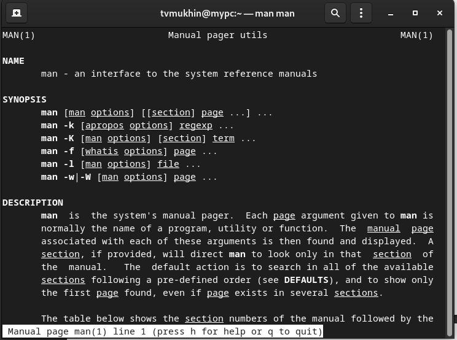{ #fig:001 width=70% }

## Выполнение работы

2. Команда cd используется для перемещения по файловой системе операционной системы типа Linux.

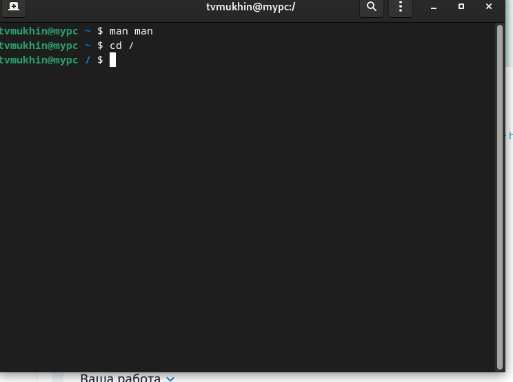{ #fig:001 width=70% }

## Выполнение работы

3. Для определения абсолютного пути к текущему каталогу используется
команда pwd (print working directory).

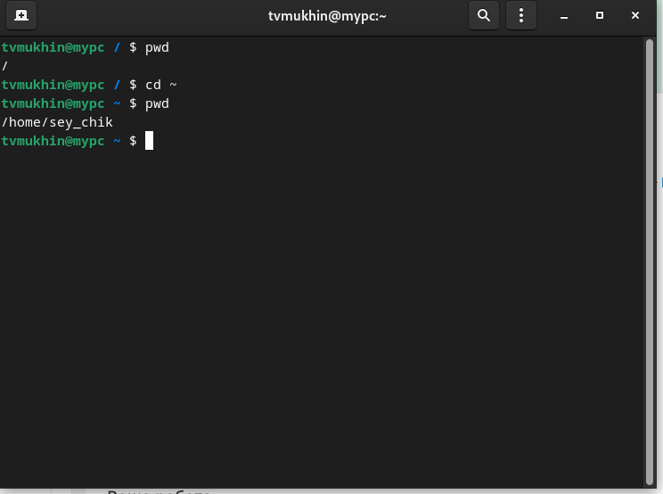{ #fig:001 width=70% }

## Выполнение работы

4. Команда ls используется для просмотра содержимого каталога.

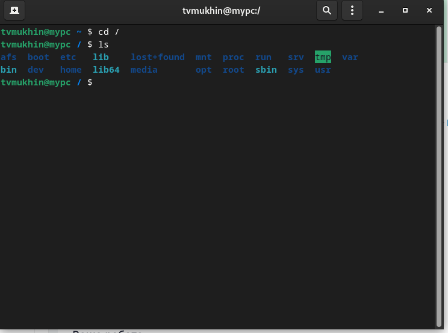{ #fig:001 width=70% }

## Выполнение работы

5. Команда mkdir используется для создания каталогов.

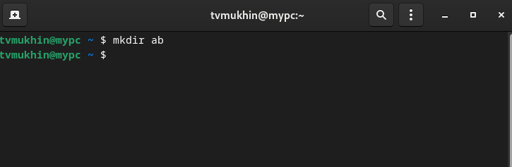{ #fig:001 width=70% }

## Выполнение работы

6. Для вывода на экран списка ранее выполненных команд используется команда history.

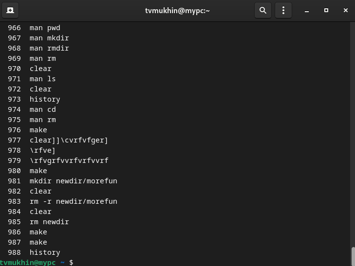{ #fig:001 width=70% }

## Выполнение работы

7. Определяем полное имя домашнего каталога.

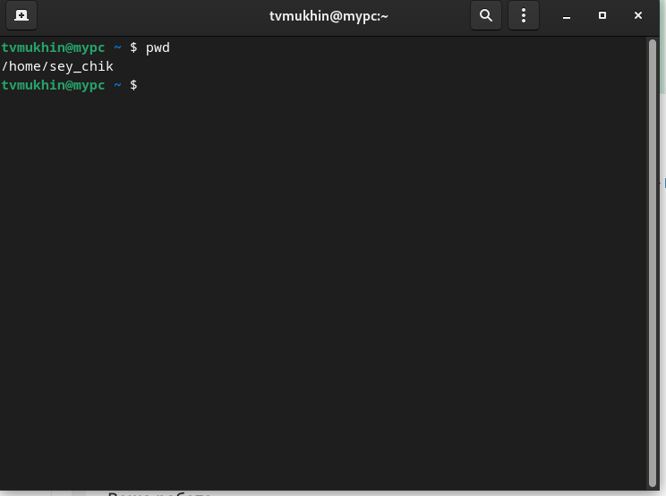{ #fig:001 width=70% }

## Выполнение работы

8. Переходим в каталог /tmp, выводим его содержимое командой ls.  Используя опцию -l можно получить подробную информацию  о содержимом.

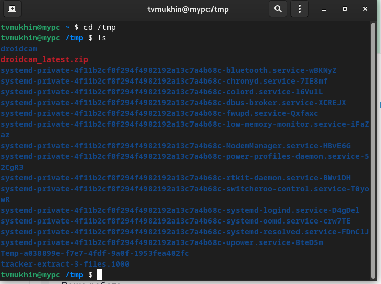{ #fig:001 width=70% }

## Выполнение работы

9. Определяем, есть ли в каталоге /var/spool подкаталог с именем cron.

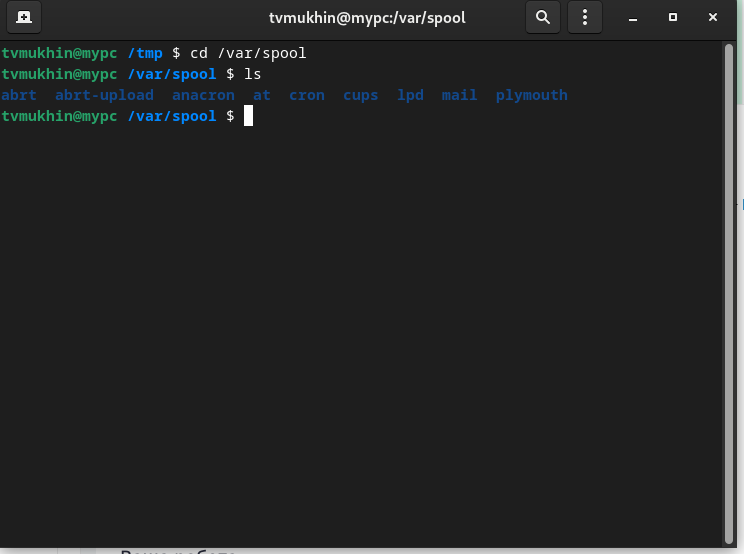{ #fig:001 width=70%

## Выполнение работы

10.  Переходим в домашний каталог и выводим на экран его содержимое. Определяем, кто является владельцем файлов.

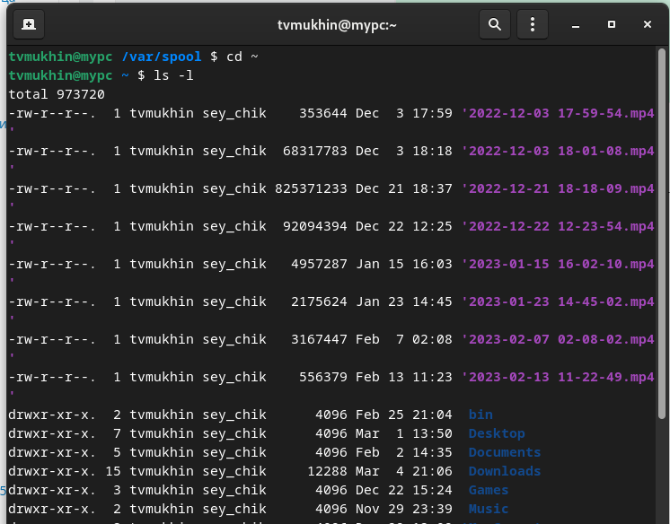{ #fig:001 width=70% }

## Выполнение работы

11. В домашнем каталоге создаем каталог newdir, в нем создаем каталог с именем morefun

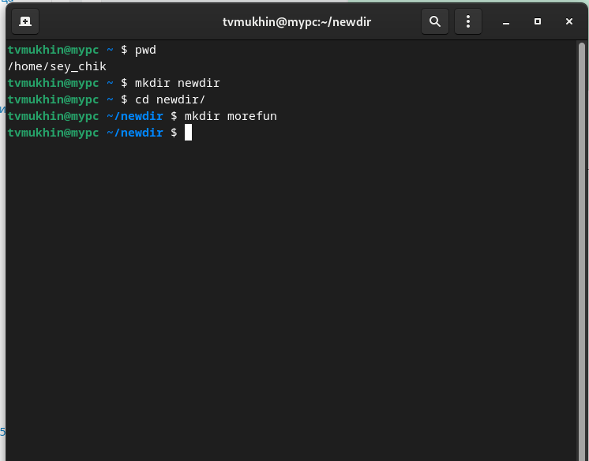{ #fig:001 width=70% }

## Выполнение работы

12. В домашнем каталоге создаем одной командой три новых каталога. Удаляем их одной командой

{ #fig:001 width=70%}

## Выполнение работы

13. Пробуем удалить /newdir командой rm

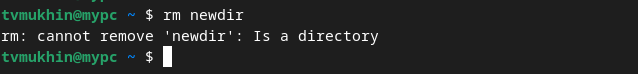{ #fig:001 width=70%}

## Выполнение работы

14. Удаляем /newdir/morefun.

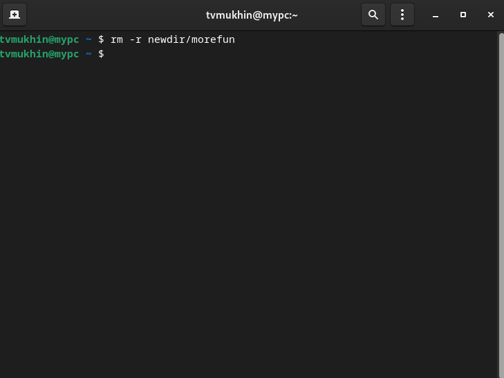{ #fig:001 width=70%}

## Выполнение работы

15. С помощью команды man определяем, какую опцию команды ls нужно использовать для просмотра содержимое не только указанного каталога, но и подкаталогов,
входящих в него.

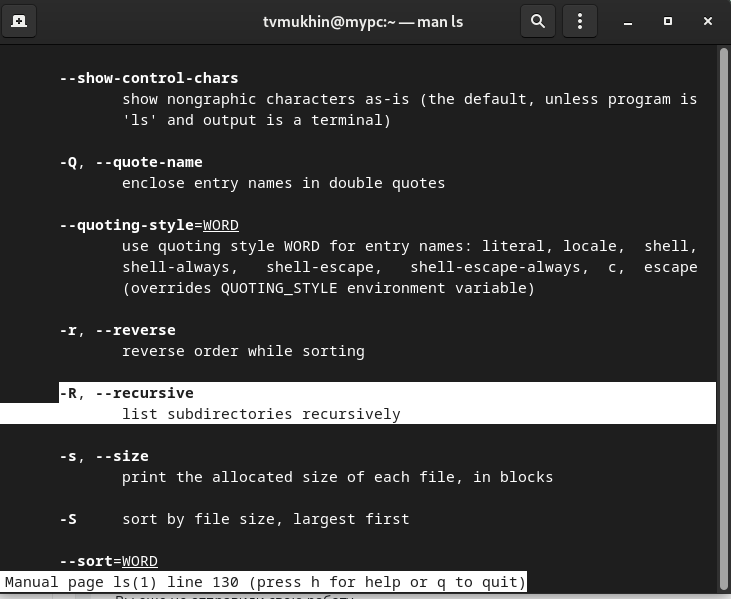{ #fig:001 width=70%}

## Выполнение работы

16. С помощью команды man определяем набор опций команды ls, позволяющий отсортировать по времени последнего изменения выводимый список содержимого каталога
с развёрнутым описанием файлов.

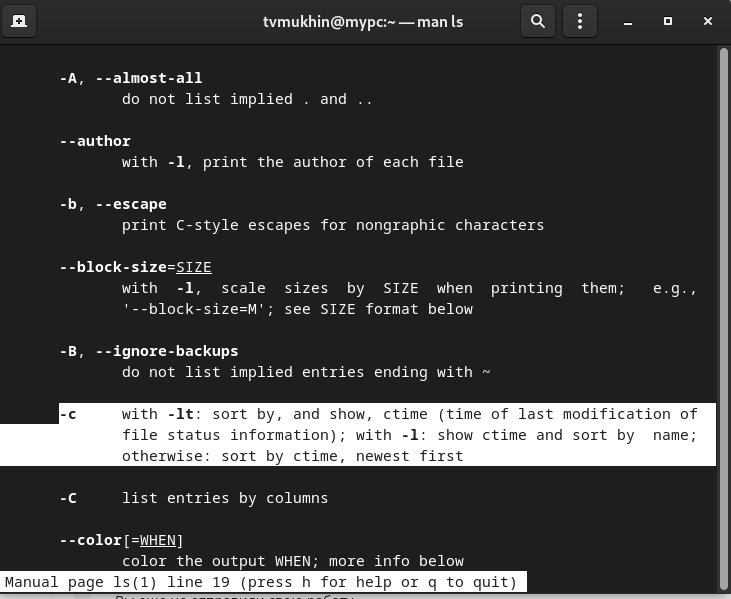{ #fig:001 width=70%}

## Выполнение работы

17. Используем команду man для просмотра описания следующих команд: cd, pwd, mkdir,
rmdir, rm.

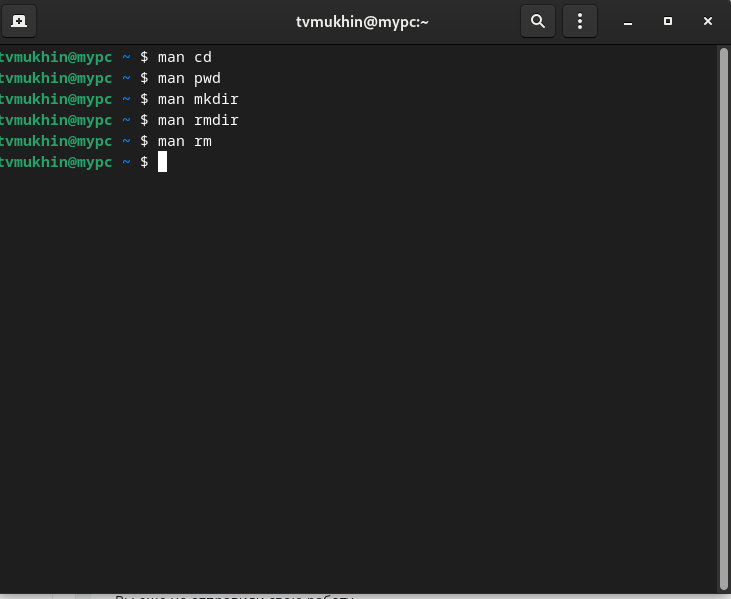{ #fig:001 width=70%}

## Выполнение работы

18.1. Используя информацию, полученную при помощи команды history, выполняем модификацию и исполнение нескольких команд из буфера команд.

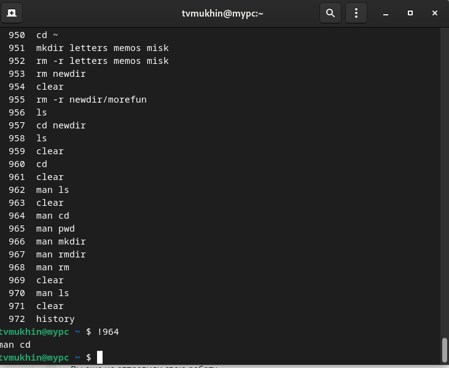{ #fig:001 width=70%}

## Выполнение работы

18.2. Используя информацию, полученную при помощи команды history, выполняем модификацию и исполнение нескольких команд из буфера команд.

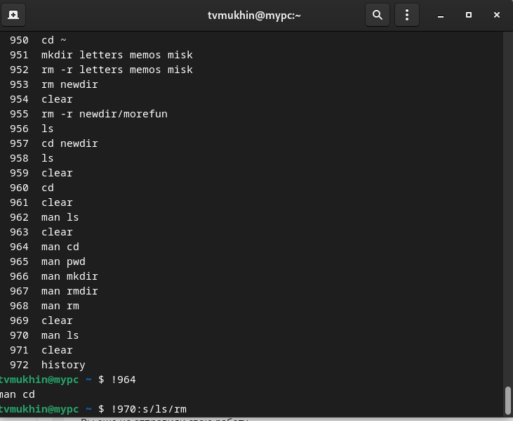{ #fig:001 width=70%}

# Вывод

## Вывод 

В ходе выполнения лабораторной работы я приобрел практические навыки взаимодействия пользователя с системой посредством командной строки.
