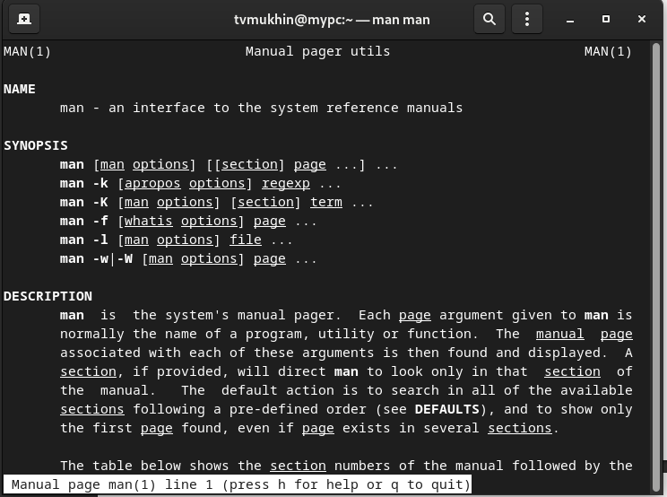

---
## Front matter
title: "Лабораторная работа №4"
author: "Мухин Тимофей Владимирович"

## Generic otions
lang: ru-RU
toc-title: "Содержание"

## Bibliography
bibliography: bib/cite.bib
csl: pandoc/csl/gost-r-7-0-5-2008-numeric.csl

## Pdf output format
toc: true # Table of contents
toc-depth: 2
fontsize: 12pt
linestretch: 1.5
papersize: a4
documentclass: scrreprt
## I18n polyglossia
polyglossia-lang:
  name: russian
  options:
	- spelling=modern
	- babelshorthands=true
polyglossia-otherlangs:
  name: english
## I18n babel
babel-lang: russian
babel-otherlangs: english
## Fonts
mainfont: PT Serif
romanfont: PT Serif
sansfont: PT Sans
monofont: PT Mono
mainfontoptions: Ligatures=TeX
romanfontoptions: Ligatures=TeX
sansfontoptions: Ligatures=TeX,Scale=MatchLowercase
monofontoptions: Scale=MatchLowercase,Scale=0.9
## Biblatex
biblatex: true
biblio-style: "gost-numeric"
biblatexoptions:
  - parentracker=true
  - backend=biber
  - hyperref=auto
  - language=auto
  - autolang=other*
  - citestyle=gost-numeric
## Pandoc-crossref LaTeX customization
figureTitle: "Рис."
tableTitle: "Таблица"
listingTitle: "Листинг"
lolTitle: "Листинги"
## Misc options
indent: true
header-includes:
  - \usepackage{indentfirst}
  - \usepackage{float} # keep figures where there are in the text
  - \floatplacement{figure}{H} # keep figures where there are in the text
---

# Цель работы

Приобретение практических навыков взаимодействия пользователя с системой посредством командной строки.

# Выполнение лабораторной работы

1. Команда man используется для просмотра (оперативная помощь) в диалоговом режиме руководства (manual) по основным командам операционной системы
типа Linux.

{ #fig:001 width=70% }

2. Команда cd используется для перемещения по файловой системе операционной системы типа Linux.

{ #fig:001 width=70% }

3. Для определения абсолютного пути к текущему каталогу используется
команда pwd (print working directory).

{ #fig:001 width=70% }

4. Команда ls используется для просмотра содержимого каталога.

{ #fig:001 width=70% }

5. Команда mkdir используется для создания каталогов.

{ #fig:001 width=70% }

6. Для вывода на экран списка ранее выполненных команд используется команда history.

{ #fig:001 width=70% }

7. Определяем полное имя домашнего каталога.

{ #fig:001 width=70% }

    
8. Переходим в каталог /tmp, выводим его содержимое командой ls.  Используя опцию -l можно получить подробную информацию  о содержимом.

{ #fig:001 width=70% }

9. Определяем, есть ли в каталоге /var/spool подкаталог с именем cron.

{ #fig:001 width=70% }

10. Переходим в домашний каталог и выводим на экран его содержимое. Определяем, кто является владельцем файлов.

{ #fig:001 width=70% }

11. В домашнем каталоге создаем каталог newdir, в нем создаем каталог с именем morefun

{ #fig:001 width=70% }

12. В домашнем каталоге создаем одной командой три новых каталога. Удаляем их одной командой

{ #fig:001 width=70%}

13. Пробуем удалить /newdir командой rm

{ #fig:001 width=70%}

14. Удаляем /newdir/morefun.

{ #fig:001 width=70%}

15. С помощью команды man определяем, какую опцию команды ls нужно использовать для просмотра содержимое не только указанного каталога, но и подкаталогов,
входящих в него.

{ #fig:001 width=70%}

16. С помощью команды man определяем набор опций команды ls, позволяющий отсортировать по времени последнего изменения выводимый список содержимого каталога
с развёрнутым описанием файлов.

{ #fig:001 width=70%}

17. Используем команду man для просмотра описания следующих команд: cd, pwd, mkdir,
rmdir, rm.

{ #fig:001 width=70%}

18. Используя информацию, полученную при помощи команды history, выполняем модификацию и исполнение нескольких команд из буфера команд.

{ #fig:001 width=70%}

{ #fig:001 width=70%}

# Выводы

В ходе выполнения лабораторной работы я приобрел практические навыки взаимодействия пользователя с системой посредством командной строки.
