---
## Front matter
lang: ru-RU
title: "Выполнение индивидуального проекта. Этап 1."
author: "Мухин Тимофей Владимирович" 
institute: "Российский Университет Дружбы Народов" 
date:   "02.2023"

## Formatting
toc: false
slide_level: 2
theme: metropolis
header-includes: 
 - \metroset{progressbar=frametitle,sectionpage=progressbar,numbering=fraction}
 - '\makeatletter'
 - '\beamer@ignorenonframefalse'
 - '\makeatother'
aspectratio: 43
section-titles: true
---

# Цель работы 

## Цель работы

Создание персонального сайта. 
В рамках этапа 1 необходимо создать и разместить на Github заготовку для персонального сайта.

# Выполнение работы

## Выполнение работы

1. Скачиваем архив с репозитория: https://github.com/gohugoio/hugo/releases.

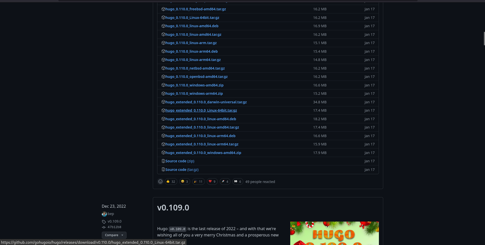{ #fig:001 width=80% }

## Выполнение работы

2.  Распаковываем в ~/bin.

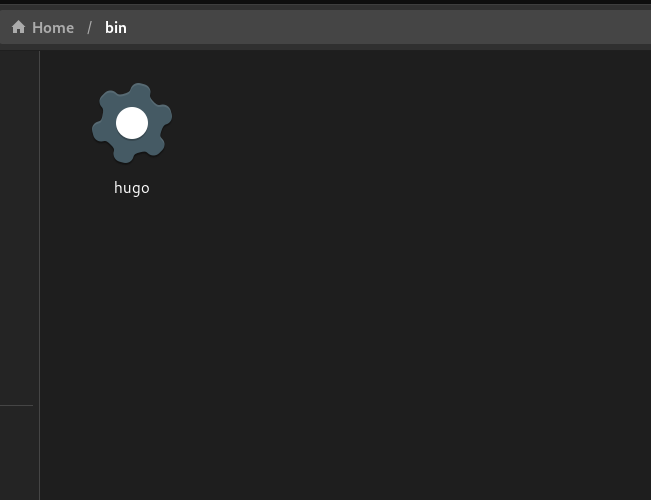{ #fig:001 width=70% }

## Выполнение работы

3. В качестве шаблона индивидуального сайта используется шаблон Hugo Academic Theme. Переходим в репозиторий, создаем свой репозиторий с названием blog на основе wowchemy/starter-hugo-academic.

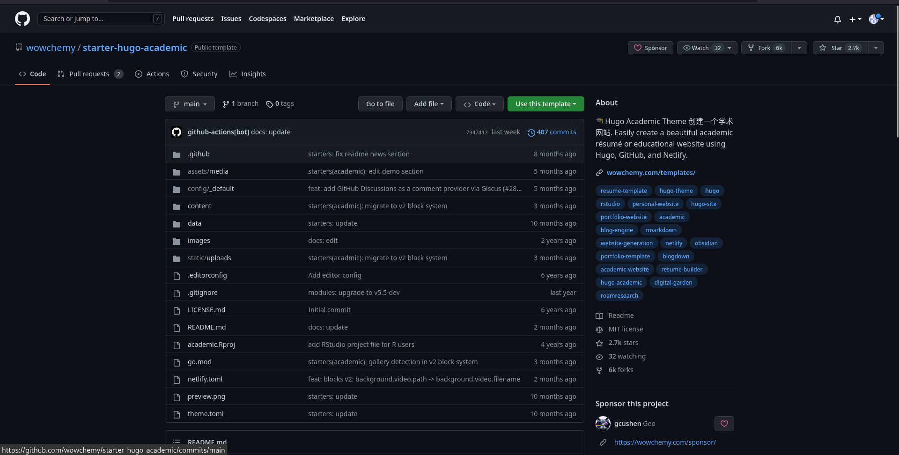{ #fig:001 width=80% }

## Выполнение работы

3.1 Переходим в репозиторий, создаем свой репозиторий с названием blog на основе wowchemy/starter-hugo-academic.

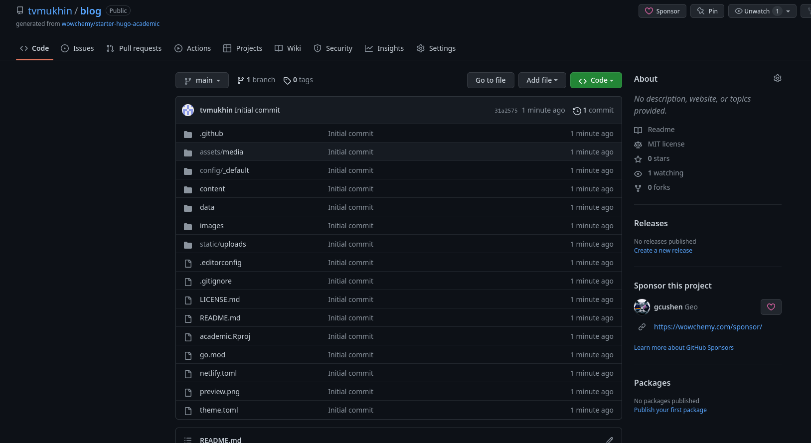{ #fig:001 width=80% }

## Выполнение работы

4. Клонируем репозиторий в директорию work на своем компьютере. 

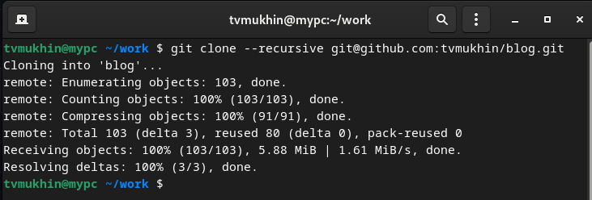{ #fig:001 width=70% }

## Выполнение работы

5. Генерируем необходимые для сайта файлы с помощью hugo.  ~/bin/hugo, а также ~/bin/hugo server .

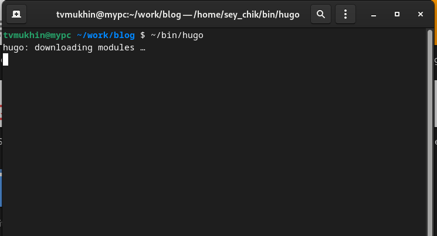{ #fig:001 width=70% }

## Выполнение работы

6. Сайт доступен локально на компьютере.

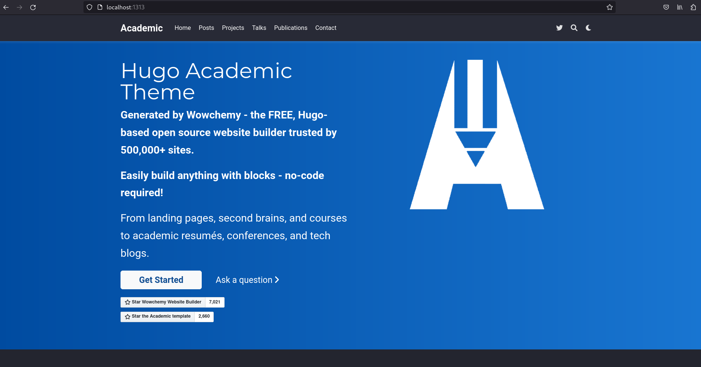{ #fig:001 width=70% }

## Выполнение работы

7.1.  Создаем новый репозиторий с названием tvmukhin.github.io

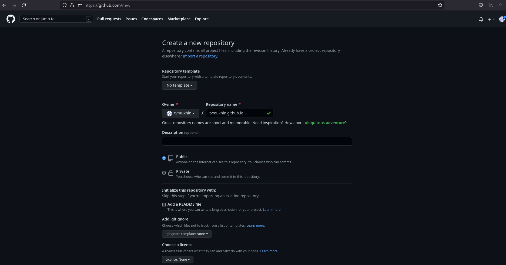{ #fig:001 width=70% }

## Выполнение работы

7.2. Создаем новый репозиторий с названием tvmukhin.github.io

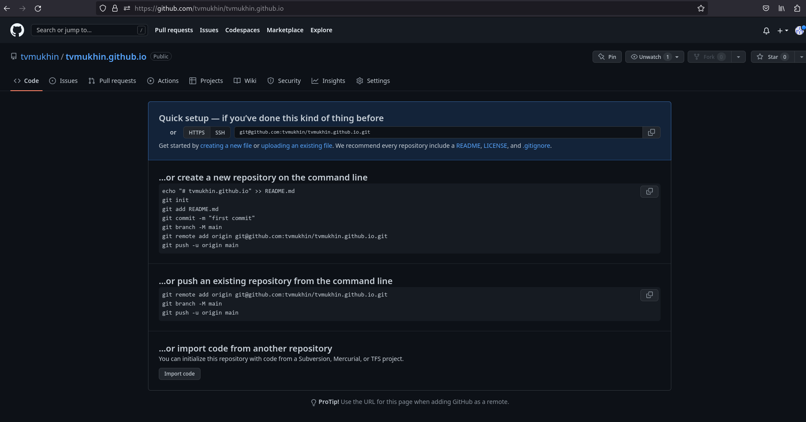{ #fig:001 width=70% }

## Выполнение работы

8. Клонируем репозиторий в директорию work.

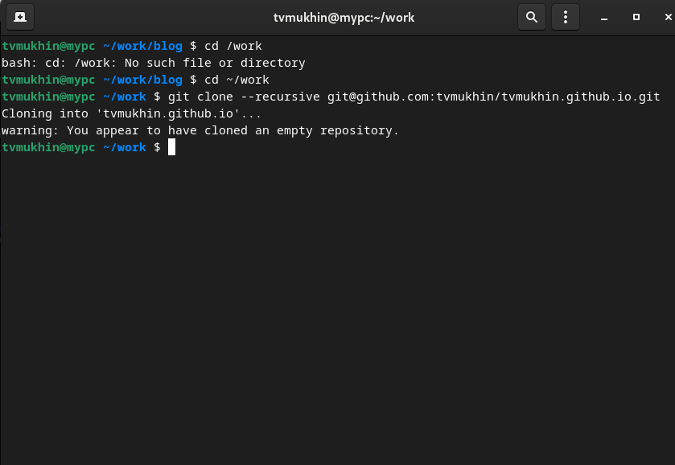{ #fig:001 width=70% }

## Выполнение работы

9. Переключаемся на ветку main.

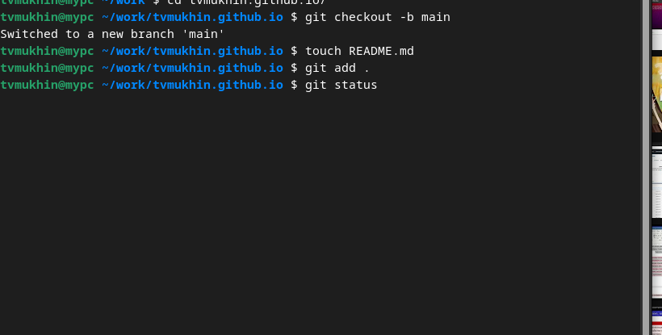{ #fig:001 width=70% }

## Выполнение работы

10. Переходим в директорию work/blog. Связываем директорию public в blog с репозиторием tvmukhin@github.io с помощью git submodule.

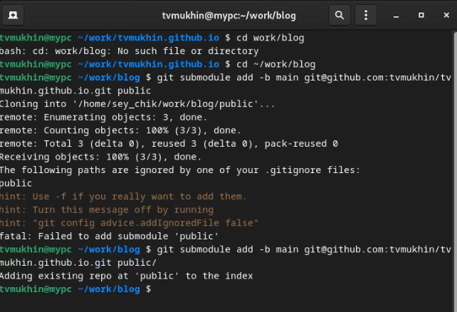{ #fig:001 width=70% }

## Выполнение работы

11. Генерируем файлы для сайта с помощью bin/hugo.

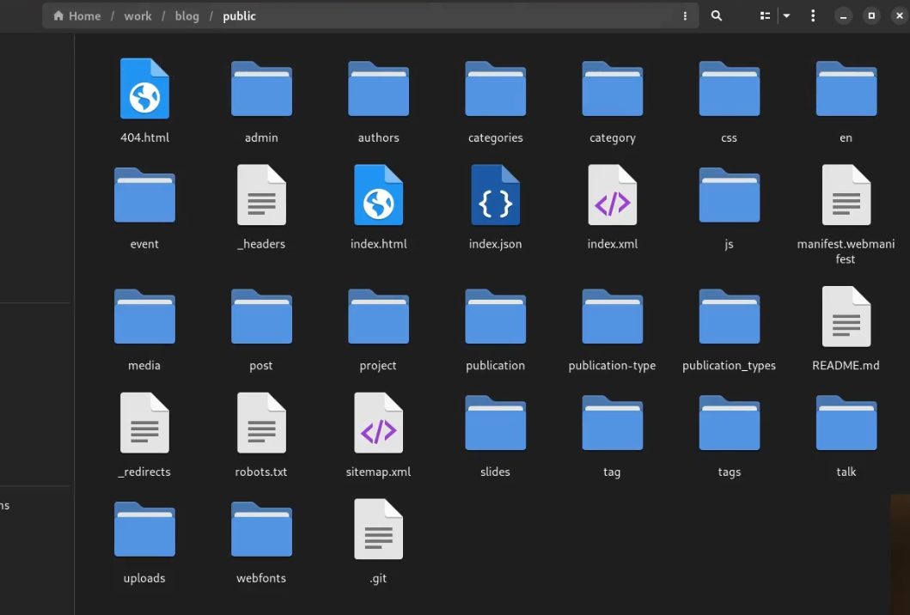{ #fig:001 width=70% }

## Выполнение работы

12. Делаем commit, отправляем изменения на сервер.
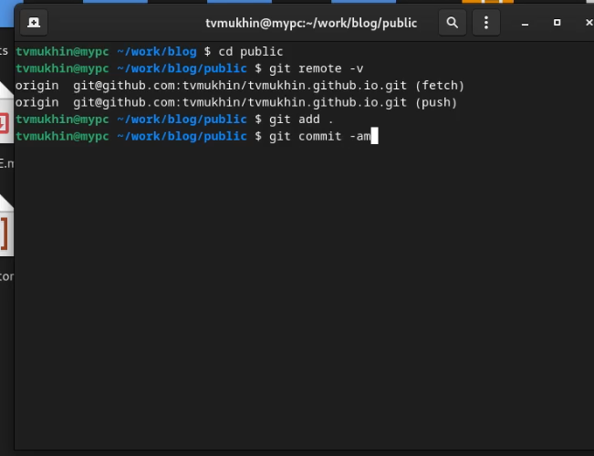{ #fig:001 width=50% }

# Вывод

## Вывод 

В результате выполнения первого этапа индивидуального проекта была создана на основе шаблона Hugo и размещена на Github заготовка для персонального сайта. 
