---
## Front matter
title: "Выполнение индивидуального проекта. Этап 1."
author: "Мухин Тимофей Владимирович"

## Generic otions
lang: ru-RU
toc-title: "Содержание"

## Bibliography
bibliography: bib/cite.bib
csl: pandoc/csl/gost-r-7-0-5-2008-numeric.csl

## Pdf output format
toc: true # Table of contents
toc-depth: 2
fontsize: 12pt
linestretch: 1.5
papersize: a4
documentclass: scrreprt
## I18n polyglossia
polyglossia-lang:
  name: russian
  options:
	- spelling=modern
	- babelshorthands=true
polyglossia-otherlangs:
  name: english
## I18n babel
babel-lang: russian
babel-otherlangs: english
## Fonts
mainfont: PT Serif
romanfont: PT Serif
sansfont: PT Sans
monofont: PT Mono
mainfontoptions: Ligatures=TeX
romanfontoptions: Ligatures=TeX
sansfontoptions: Ligatures=TeX,Scale=MatchLowercase
monofontoptions: Scale=MatchLowercase,Scale=0.9
## Biblatex
biblatex: true
biblio-style: "gost-numeric"
biblatexoptions:
  - parentracker=true
  - backend=biber
  - hyperref=auto
  - language=auto
  - autolang=other*
  - citestyle=gost-numeric
## Pandoc-crossref LaTeX customization
figureTitle: "Рис."
tableTitle: "Таблица"
listingTitle: "Листинг"
lolTitle: "Листинги"
## Misc options
indent: true
header-includes:
  - \usepackage{indentfirst}
  - \usepackage{float} # keep figures where there are in the text
  - \floatplacement{figure}{H} # keep figures where there are in the text
---

# Цель работы
Создание персонального сайта. 
В рамках этапа 1 необходимо создать и разместить на Github заготовку для персонального сайта.

# Выполнение индивидуального проекта. Этап 1.

1. Скачиваем архив с репозитория: https://github.com/gohugoio/hugo/releases.

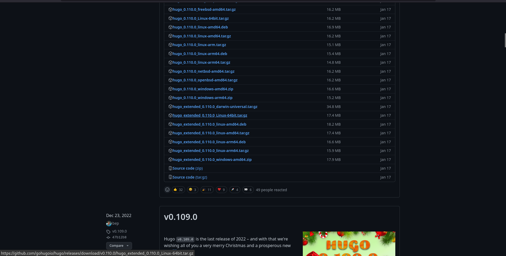{ #fig:001 width=70% }

2. Распаковываем в ~/bin.

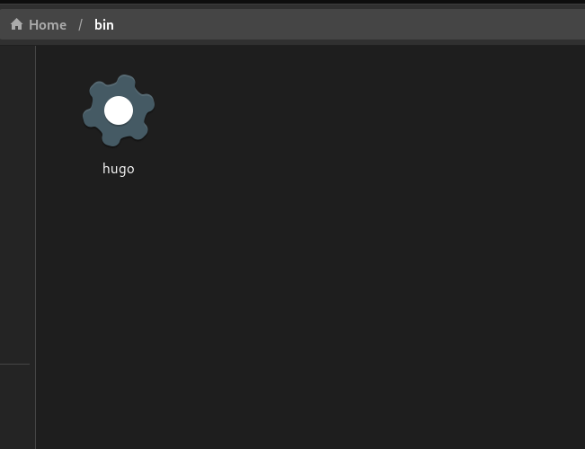{ #fig:002 width=70% }

3. В качестве шаблона индивидуального сайта используется шаблон Hugo Academic Theme. Переходим в репозиторий, создаем свой репозиторий с названием blog на основе wowchemy/starter-hugo-academic.

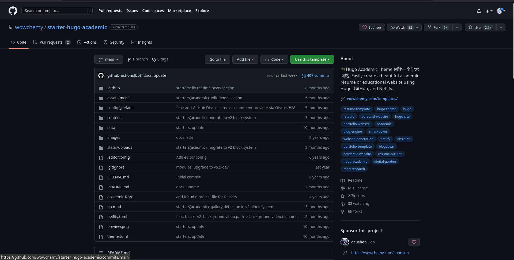{ #fig:003 width=70% }

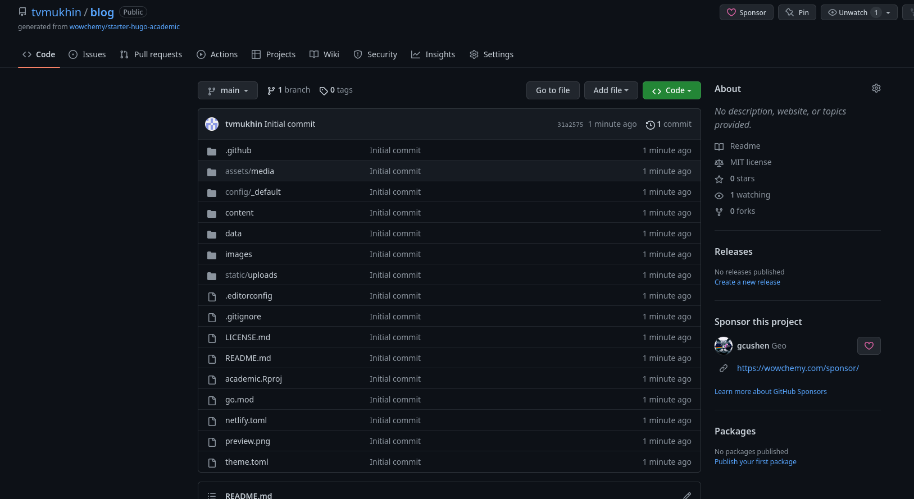{ #fig:003 width=70% }

4.  Клонируем репозиторий в директорию work на своем компьютере. 

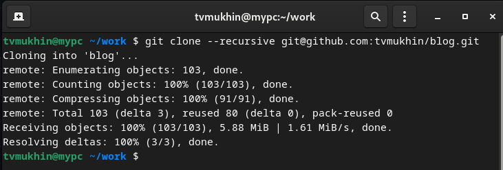{ #fig:004 width=70% }

5. Генерируем необходимые для сайта файлы с помощью hugo.  ~/bin/hugo, а также ~/bin/hugo server .

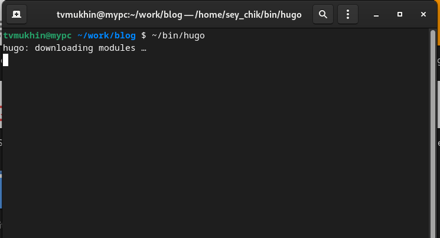{ #fig:005 width=70% }

6. Сайт доступен локально на компьютере.

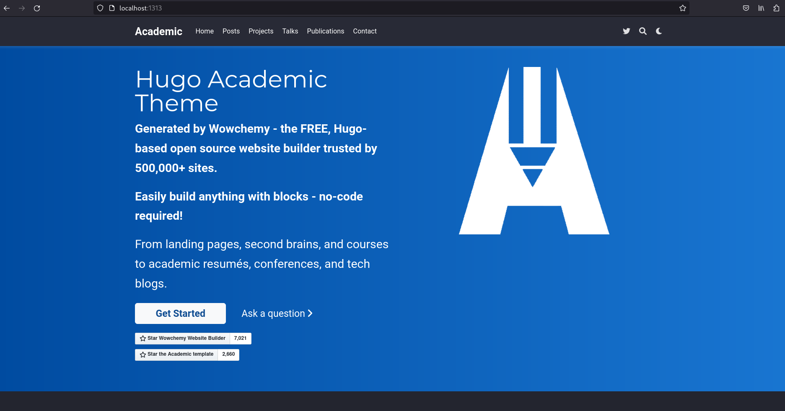{ #fig:006 width=70% }

7. Создаем новый репозиторий с названием tvmukhin.github.io

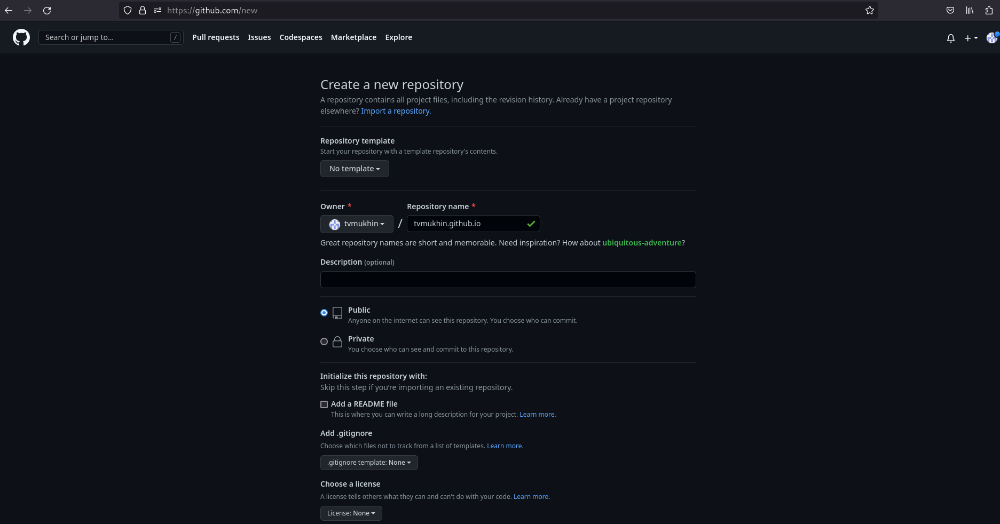{ #fig:007 width=70% }

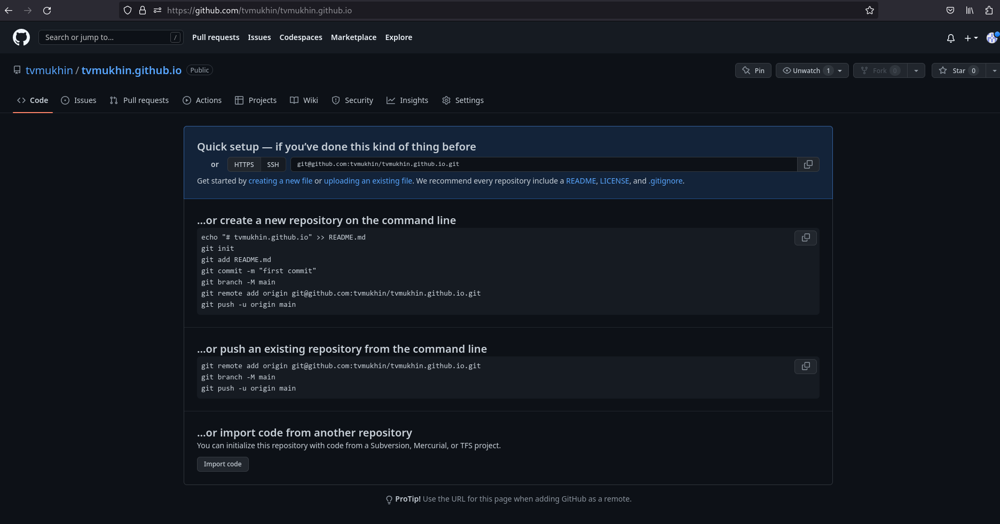{ #fig:007 width=70% }

8. Клонируем репозиторий в директорию work.

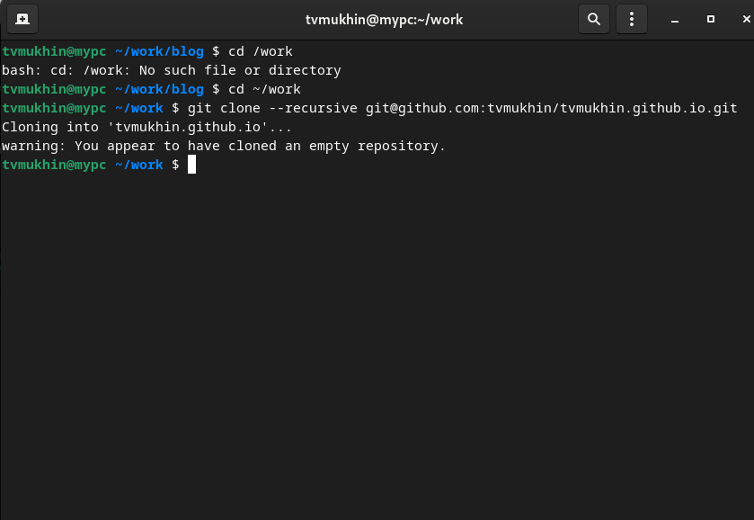{ #fig:007 width=70% }

9. Переключаемся на ветку main.

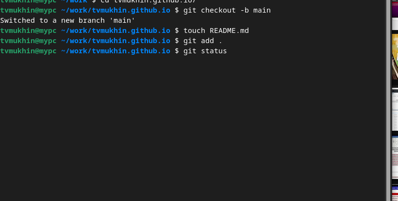{ #fig:007 width=70% }

10. Переходим в директорию work/blog. Связываем директорию public в blog с репозиторием tvmukhin@github.io с помощью git submodule.

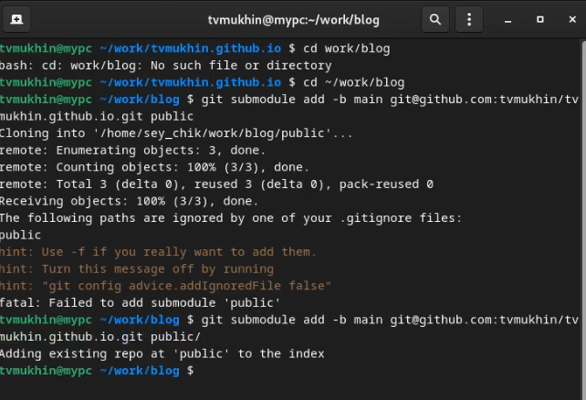{ #fig:007 width=70% }

11. Генерируем файлы для сайта с помощью bin/hugo.

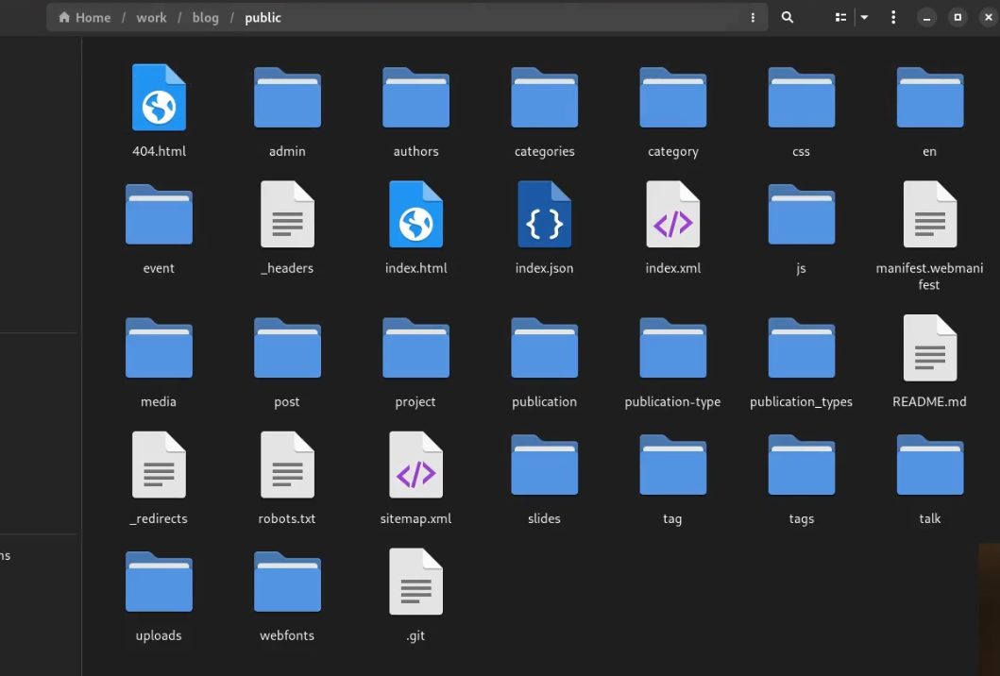{ #fig:007 width=70% }

12. Делаем commit, отправляем изменения на сервер.

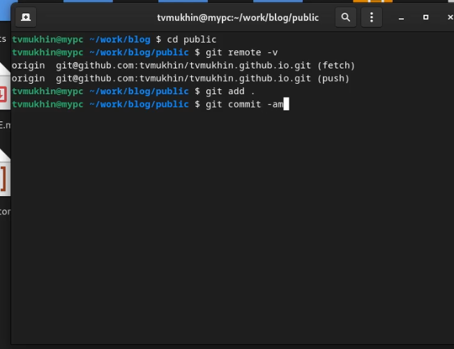{ #fig:007 width=70% }

# Выводы

В результате выполнения первого этапа индивидуального проекта была создана на основе шаблона Hugo и размещена на Github заготовка для персонального сайта. 

